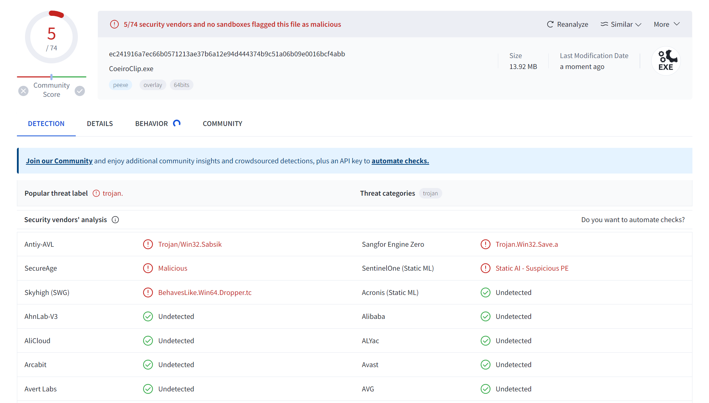

#  CoeiroClip

Copyright (c) 2024 led-mirage

## 概要

クリップボードに貼り付けられたテキストを COEIROINK で読み上げるアプリです。

[COEIROINK公式ページ](https://coeiroink.com/)

このソフトウェアは、[VoivoClip](https://github.com/led-mirage/VoivoClip) の COEIROINK 版です。

## スクリーンショット


## 機能

- クリップボード監視の開始と停止
- キャラクター選択
- リピート
- 設定値の自動保存

## 動作確認環境

- Windows 11 Pro 23H2
- Python 3.12.0
- COEIROINK v2.2.1

## 実行方法

### 🛩️ 実行ファイル（EXE）を使う場合

#### 1. プロジェクト用のフォルダの作成

任意の場所にプロジェクト用のフォルダを作成してください。

#### 2. アプリのダウンロード

以下のリンクから CoeiroClip.ZIP をダウンロードして、作成したフォルダに展開してください。

https://github.com/led-mirage/CoeiroClip/releases/tag/v0.2.2

#### 3. 実行

COEIROINKを起動してから CoeiroClip.exe または CoeiroClipNC.exe をダブルクリックすればアプリが起動します。  
CoeiroClip.exe はコンソールも一緒に起動するバージョンで、CoeiroClipNC.exe はコンソールが起動しないバージョンです。  

### 🛩️ Pythonで実行する場合

#### 1. プロジェクト用のフォルダの作成

任意の場所にプロジェクト用のフォルダを作成してください。

#### 2. ターミナルの起動

ターミナルかコマンドプロンプトを起動して、作成したプロジェクトフォルダに移動します。

#### 3. ソースファイルのダウンロード

ZIPファイルをダウンロードして作成したフォルダに展開してください。  
または、Gitが使える方は以下のコマンドを実行してクローンしてもOKです。

```bash
git clone https://github.com/led-mirage/CoeiroClip.git
```

#### 4. ライブラリのインストール

以下のコマンドを実行して必要なライブラリをインストールします。

```bash
pip install -r requirements.txt
```

#### 5. 実行

COEIROINK を起動したのち、以下のコマンドを実行するとアプリが起動します。  

```bash
python application.py
```

## 設定

### ⚙️ アプリケーション設定ファイル（オプション）

`settings.json`ファイルにはこのアプリの設定情報が記載されています。

#### ✨ speaker_id（既定値 0）

COEIROINKのキャラクターのStyleIdを記載します。アプリのGUIで設定できます。

#### ✨ speed_scale（既定値 1.2）

読み上げの速さの設定です。アプリのGUIで設定できます。

#### ✨ pitch_scale（既定値 0.0）

声の高さの設定です。声の高さを変更したい場合は、この値を編集してください。微妙な値で大きく変わる可能性があるので、0.1とか0.2刻みで調整するといいと思います。

#### ✨ coeiroink_server（既定値 http://127.0.0.1:50032）

COEIROINKのローカルサーバーのURLを記載します。普通は変更する必要はありません。

#### ✨ coeiroink_install_path（既定値 空文字列）

COEIROINKを自動起動するために使用します。COEIROINKの実行ファイルのパスを記載してください。COEIROINKに既定のインストール場所はありませんので、この設定は初期状態では空になっています。例えば次のように記載します。

```json
"coeiroink_install_path": "C:/Program Files/COEIROINK_GPU/COEIROINKv2.exe"
```

#### ✨ replacements（既定値 []）

読み上げるテキストの置換設定です。置換対象（pattern）を正規表現で、置換後の文字列（replacement）を通常の文字列で指定します。

例えば括弧内のテキストと、URLを除去して読み上げたい場合は、以下のように設定します。置換パターンは複数個記載でき、上から順に処理されます。

```json
    "replacements": [
        {
            "pattern": "\\(.*?\\)|（.*?）",
            "replacement": ""
        },
        {
            "pattern": "https?:\\/\\/(?:[\\w\\-\\.]+)+(?:[\\w\\.\\/\\?%&=]*)?",
            "replacement": ""
        }
    ]
```

## 注意事項

### ⚡ ウィルス対策ソフトの誤認問題

このプログラムの実行ファイル（CoeiroClip.exe、CoeiroClipNC.exe）は PyInstaller というライブラリを使って作成していますが、ウィルス対策ソフトにマルウェアと誤認されることがあります。

もちろん、このアプリに悪意のあるプログラムは入っていませんが、気になる人は上記の「Pythonで実行する方法」で実行してください。

誤認問題が解決できるのが一番いいのですが、いい方法が見つかっていないので申し訳ありませんがご了承ください。

VirusTotalでのチェック結果は以下の通りです（2024/06/08 v0.2.2）

- CoeiroClip.exe … 72個中5個のアンチウィルスエンジンで検出
- CoeiroClipNC.exe … 72個中8個のアンチウィルスエンジンで検出



## 使用しているライブラリ

### 🔖 requests 2.31.0

ホームページ： https://requests.readthedocs.io/en/latest/  
ライセンス：[Apache License 2.0](https://github.com/psf/requests/blob/main/LICENSE) 

### 🔖 pyperclip 1.8.2 

ホームページ： https://github.com/asweigart/pyperclip/tree/master  
ライセンス：[BSD 3-Clause "New" or "Revised" License](https://github.com/asweigart/pyperclip/blob/master/LICENSE.txt)

### 🔖 PyAudio 0.2.14

ホームページ： https://people.csail.mit.edu/hubert/pyaudio/  
ライセンス：[MIT License](https://people.csail.mit.edu/hubert/pyaudio/)

### 🔖 Pillow 10.2.0

ホームページ： https://python-pillow.org/  
ライセンス：[HPND License](https://raw.githubusercontent.com/python-pillow/Pillow/main/LICENSE)

## ライセンス

© 2024 led-mirage

本アプリケーションは [MITライセンス](https://opensource.org/licenses/MIT) の下で公開されています。詳細については、プロジェクトに含まれる LICENSE ファイルを参照してください。

## バージョン履歴

### 0.1.0 (2024/01/14)

- ファーストリリース

### 0.2.0 (2024/04/13)

- 置換文字列を設定できるように変更（正規表現で指定）

### 0.2.1 (2024/06/02)

- 正規表現で置換する処理を微修正

### 0.2.2 (2024/06/08)

- 再生環境による文末の音声途切れ問題を軽減するため、再生終了後に0.2秒間の待機時間を追加
